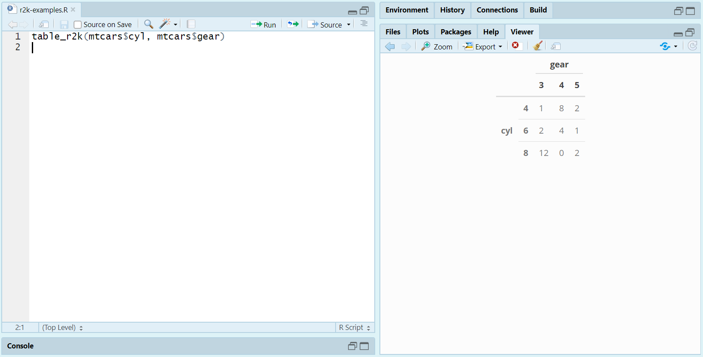

<!-- README.md is generated from README.Rmd. Please edit that file -->

```{r setup, include = FALSE}
knitr::opts_chunk$set(
  collapse = TRUE,
  comment = "#>", 
  message = FALSE
)

# Load packages
library("r2k")
library("knitr")

# Set xtable options
options("xtable.caption.placement" = "top", 
        "xtable.include.rownames" = TRUE, 
        "xtable.comment" = FALSE)
```


## Installation

You can install and load **r2k** from GitHub via the following code:

```{r, eval = FALSE}
devtools::install_github("vandomed/r2k")
library("r2k")
```


## Concept

The idea is to provide functions that work just like a common base R function, like `table` and `glm`, but that immediately produce neat `kable` outputs. For example, you can call `table_r2k` just as you would `table`, but the result will be a `kable` that is immediately printed to the RStudio Viewer, and which is immediately ready for printing in an R Markdown document.


## Functions

### table_r2k

If you swap in `table_r2k` for `table`, the results will print neatly to the Viewer:

```{r eval = FALSE}
table_r2k(mtcars$cyl, mtcars$gear)
```



From there, you can "snip" the table and save it as a figure (as I did for this README) or copy directly from the Viewer and paste outside of R. In my experience, output from the Viewer pastes pretty nicely into Microsoft Word, Excel, and PowerPoint. 

Alternatively, if you call `table_r2k` within an R Markdown document, the resulting table will appear correctly in the output file without any extra steps.


## References
