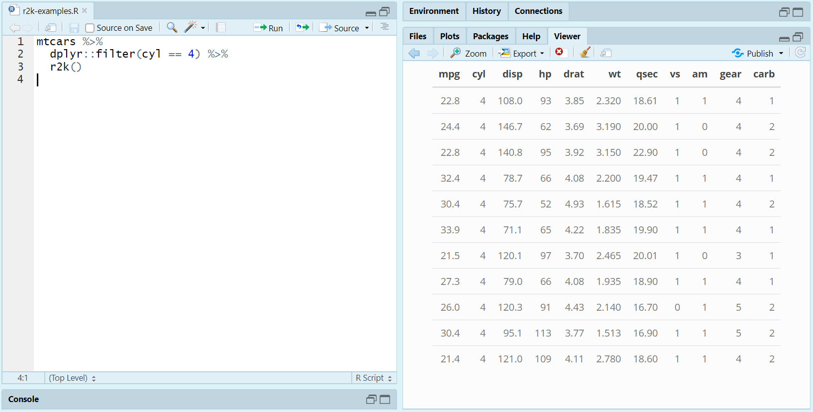

Quick Kable Outputs
================
Dane Van Domelen <br> <vandomed@gmail.com>
2020-03-29

<!-- README.md is generated from README.Rmd. Please edit that file -->

## Installation

You can install and load **r2k** from GitHub via the following code:

``` r
devtools::install_github("vandomed/r2k")
library("r2k")
```

## Concept

The idea is to provide functions that work just like a common base R
function, like `table` and `glm`, but that immediately produce neat
`kable` outputs. For example, you can call `table_r2k` just as you would
`table`, but the result will be a `kable` that is immediately printed to
the RStudio Viewer, and which is immediately ready for printing in an R
Markdown document.

## Functions

### table\_r2k

If you swap in `table_r2k` for `table`, the results will print neatly to
the Viewer:

``` r
table_r2k(mtcars$cyl, mtcars$gear)
```


From there, you can “snip” the table and save it as a figure (as I did
for this README) or copy directly from the Viewer and paste outside of
R. In my experience, output from the Viewer pastes pretty nicely into
Microsoft Word, Excel, and PowerPoint.

Alternatively, if you call `table_r2k` within an R Markdown document,
the resulting table will appear correctly in the output file without any
extra steps.

### r2k

The namesake function is very simple, it just converts R objects to
kables by calling `kable` and `kable_styling`. To print out the
4-cylinder cars in `mtcars`, using **dplyr** and piping:

``` r
mtcars %>%
  dplyr::filter(cyl == 4) %>%
  r2k()
```



## References

<div id="refs" class="references">

<div id="ref-knitr3">

Xie, Yihui. 2014. “Knitr: A Comprehensive Tool for Reproducible Research
in R.” In *Implementing Reproducible Computational Research*, edited by
Victoria Stodden, Friedrich Leisch, and Roger D. Peng. Chapman;
Hall/CRC. <http://www.crcpress.com/product/isbn/9781466561595>.

</div>

<div id="ref-knitr2">

———. 2015. *Dynamic Documents with R and Knitr*. 2nd ed. Boca Raton,
Florida: Chapman; Hall/CRC. <https://yihui.name/knitr/>.

</div>

<div id="ref-knitr1">

———. 2018. *Knitr: A General-Purpose Package for Dynamic Report
Generation in R*. <https://yihui.name/knitr/>.

</div>

</div>
