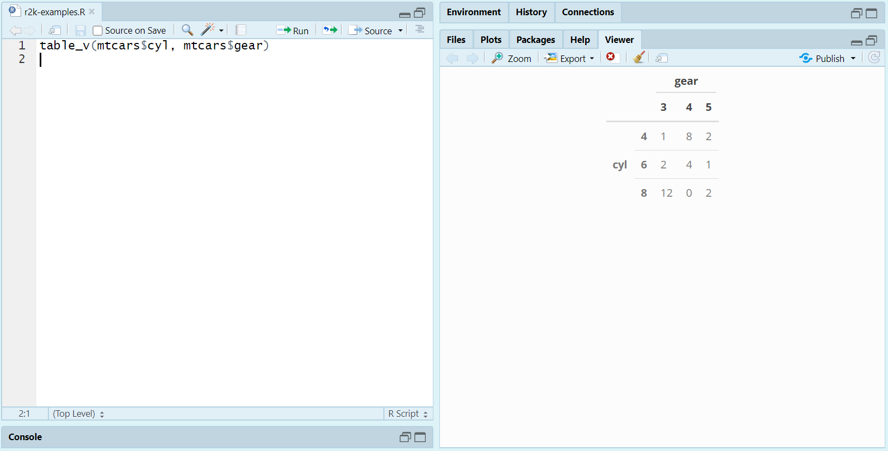
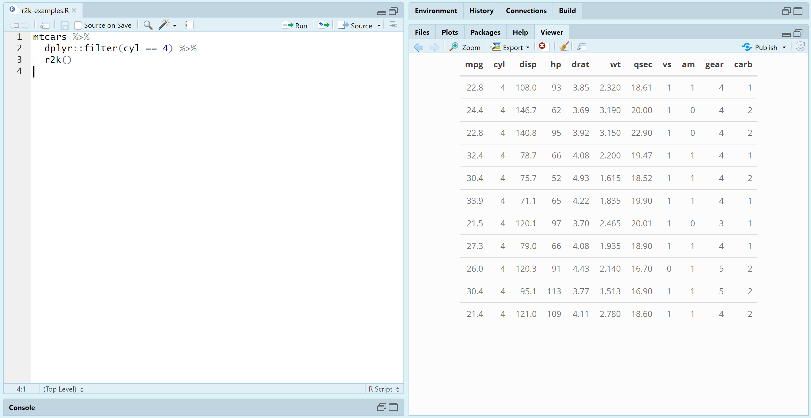

```{r setup, include = FALSE}
knitr::opts_chunk$set(
  collapse = TRUE,
  comment = "#>", 
  message = FALSE, 
  fig.width = 3
)

# Load packages
library("r2k")
library("knitr")

# Set xtable options
options("xtable.caption.placement" = "top", 
        "xtable.include.rownames" = TRUE, 
        "xtable.comment" = FALSE)
```


## Installation

To install and load **r2k** from GitHub:

```{r, eval = FALSE}
devtools::install_github("vandomed/r2k")
library("r2k")
```


## Concept

The idea is to provide functions that work just like common base R functions, like `table` and `glm`, but that immediately produce clean `kable` printed to the RStudio Viewer or to an R Markdown document.

Each function has two variants: `<function>_v` and `<function>_k`. The `_v` version (for "Viewer") prints to the Viewer but still returns the object you'd expect from `<function>`. The `_k` version (for "kable") returns a `kable` which should print nicely without any further steps in R Markdown/**knitr** documents.


## Functions

### table_v

If you swap in `table_v` for `table`, the results print neatly to the Viewer:

```{r eval = FALSE}
df <- table_v(mtcars$cyl, mtcars$gear)
```

```{r out.width = "100%", echo = FALSE}

```

From there, if you want to export the table out of R, you could "snip" the table and save it as a figure (as I did for this README) or copy directly from the Viewer and paste outside of R. In my experience, output from the Viewer pastes nicely into Word, Excel, and PowerPoint. 

Similarly, you can use `table_k` in R Markdown documents to quickly generate `kable` outputs without any extra steps.


### r2k

The namesake function is very simple: it just converts R objects to kables by calling `kable` and `kable_styling`. To print out the 4-cylinder cars in `mtcars`, using **dplyr** and piping:

```{r eval = FALSE}
mtcars %>%
  dplyr::filter(cyl == 4) %>%
  r2k()
```

```{r out.width = "100%", echo = FALSE}

```


## References
